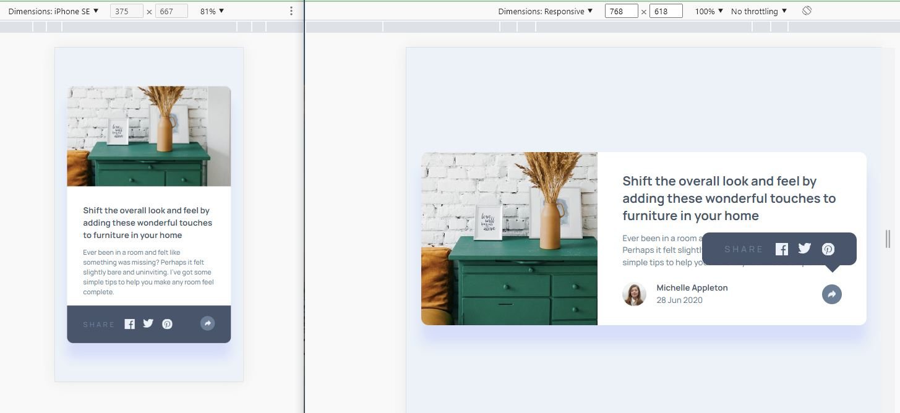

# Frontend Mentor - Article preview component solution

This is a solution to the [Article preview component challenge on Frontend Mentor](https://www.frontendmentor.io/challenges/article-preview-component-dYBN_pYFT).

## Table of contents

- [Overview](#overview)
  - [The challenge](#the-challenge)
  - [Screenshot](#screenshot)
  - [Links](#links)
- [My process](#my-process)
  - [Workflow](#workflow)
  - [Built with](#built-with)
  - [What I learned](#what-i-learned)
  - [Continued development](#continued-development)
- [Author](#author)
- [Acknowledgments](#acknowledgments)

## Overview

### The challenge

Users should be able to:

- View the optimal layout for the component depending on their device's screen size
- See the social media share links when they click the share icon

### Screenshot



### Links

- Solution: [frontendmentor.io](https://your-solution-url.com)

- Live Site: [netlify.app](https://article-preview-ch.netlify.app/)

## My process

### Workflow

 - Preparing workflow (Installing React, Adding assets)

 - Identifying and creating components
    - Article

 - Working on mobile desing based on `design` folder

 - Working on responsiveness design based on `desig` folder

 - Working on React functionality for sharing icons


### Built with

- [React](https://reactjs.org/)
- [CSS Modules](https://create-react-app.dev/docs/adding-a-css-modules-stylesheet/) - For styles
- Mobile-first workflow
- Semantic HTML5 markup
- CSS custom properties
- Flexbox
- CSS Grid


### What I learned
For smooth toggling sharing icons I used animation keyframes that was fun

```

@keyframes fadeIn {
    from { opacity: 0; }
    to { opacity: 1; }
}

.footer.active .sharing-icons {
  animation: fadeIn 1s;
}

```

### Continued development

React, React and also React

## Author

- Frontend Mentor - [@siavhnz](https://www.frontendmentor.io/profile/siavhnz)

- Gihtub - [siavhnz](https://github.com/siavhnz)

- Codepen - [@siavhnz](https://codepen.io/siavhnz)

## Acknowledgments

Thanks To

[Frontendmentor.io](https://www.frontendmentor.io/challenges) - for their Excitement challenges  

[Perfect Pixel](https://chrome.google.com/webstore/detail/perfectpixel-by-welldonec/dkaagdgjmgdmbnecmcefdhjekcoceebi?hl=en) - for such a great extension

